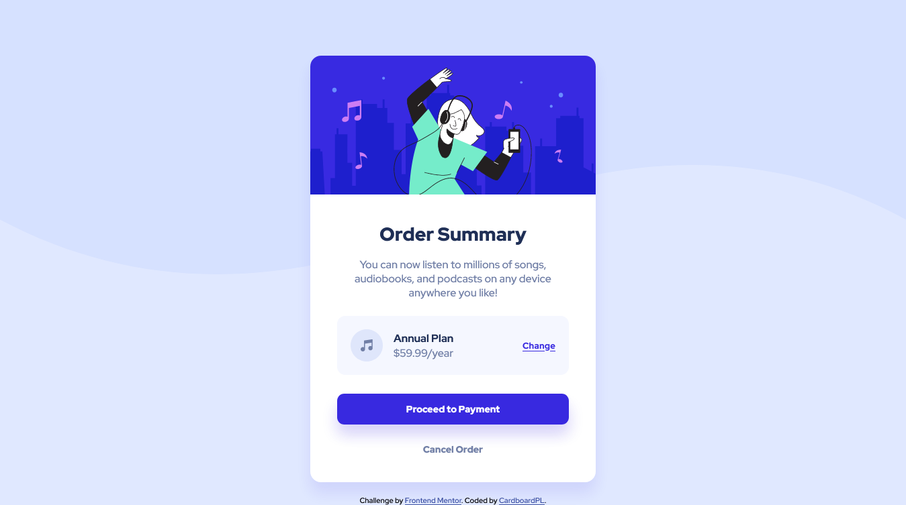

# Frontend Mentor - Order summary card solution

This is a solution to the [Order summary card challenge on Frontend Mentor](https://www.frontendmentor.io/challenges/order-summary-component-QlPmajDUj). Frontend Mentor challenges help you improve your coding skills by building realistic projects. 

## Table of contents

- [Overview](#overview)
  - [The challenge](#the-challenge)
  - [Screenshot](#screenshot)
  - [Links](#links)
- [My process](#my-process)
  - [Built with](#built-with)
  - [What I learned](#what-i-learned)
  - [Continued development](#continued-development)
  - [Useful resources](#useful-resources)
- [Author](#author)
- [Acknowledgments](#acknowledgments)

## Overview

### The challenge

Users should be able to:

- See hover states for interactive elements

### Screenshot

### Links

- Solution URL: [GitHub Repo](https://github.com/CardboardPL/Frontend-Mentor-Order-summary-card)
- Live Site URL: [GitHub Pages](https://cardboardpl.github.io/Frontend-Mentor-Order-summary-card/)

## My process

### Built with

- Semantic HTML5 markup
- Flexbox
- Desktop-first workflow

### What I learned

I learned how to make it so that images can't be interacted with.

### Continued development

I plan to make this as an inspiration.

### Useful resources

- [MDN Article about user-select](https://developer.mozilla.org/en-US/docs/Web/CSS/user-select) - This helped me relearn what user-select does.
- [MDN Article about pointer-events](https://developer.mozilla.org/en-US/docs/Web/CSS/pointer-events) - This helped me make it so that you can't right click the background images.

## Author

- Frontend Mentor - [@CardboardPL](https://www.frontendmentor.io/profile/CardboardPL)
- Twitter - [@SirPLWasTaken](https://www.twitter.com/SirPLWasTaken)